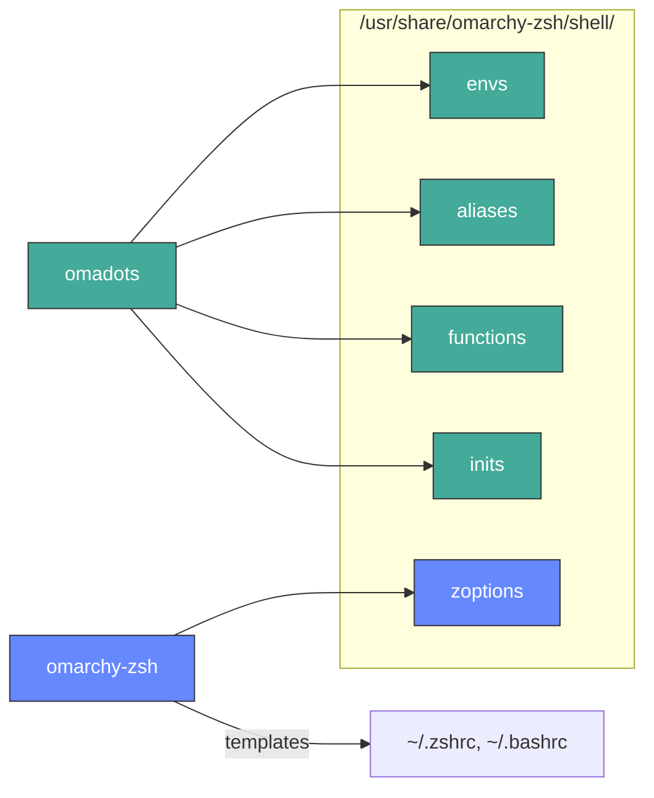
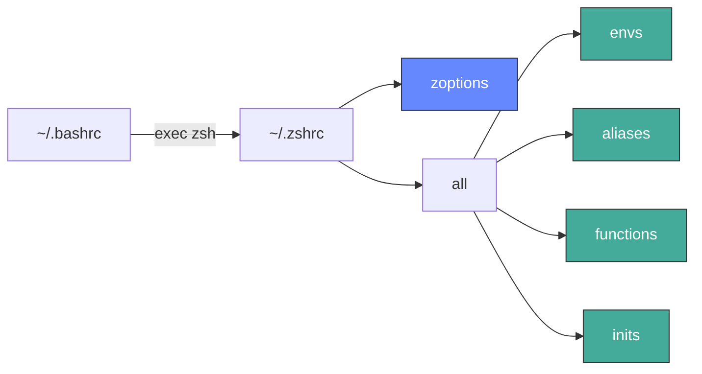

Omarchy shell configuration for Zsh shell.

## Architecture

Shared shell config (aliases, functions, environment, init) is pulled from [omadots](https://github.com/omacom-io/omadots) at package build time. This repo only contains the zsh-specific bits. Config is sourced directly from `/usr/share/` so package updates take effect immediately.

### Build



### Runtime



Green = shared (from omadots). Blue = zsh-specific (from this repo).

## Install

```bash
# Install the package
sudo pacman -S omarchy-zsh

# Setup zsh (optional: auto-launch from bash)
omarchy-setup-zsh
```

## fzf Keybindings

- **Ctrl+Alt+F** - Search files/directories
- **Ctrl+Alt+L** - Search Git Log
- **Ctrl+R** - Search command history
- **Ctrl+T** - Search files in current directory
- **Ctrl+V** - Search Variables
- **Alt+C** - cd into selected directory

## Customization

To add your own configuration or override defaults:

```bash
# Edit your .zshrc
nvim ~/.zshrc

# Add customizations at the bottom after the omarchy-zsh loading
```

User customizations in `~/.zshrc` take precedence over system defaults.

## Uninstall

```bash
sudo pacman -R omarchy-zsh
```

To restore bash, copy a backup to `~/.bashrc` (backups are saved as `.bashrc.backup-*`).
